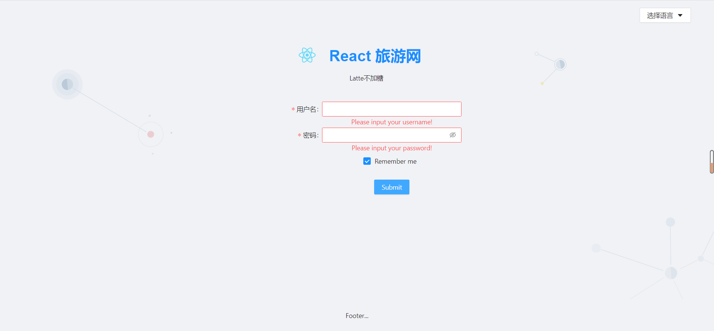
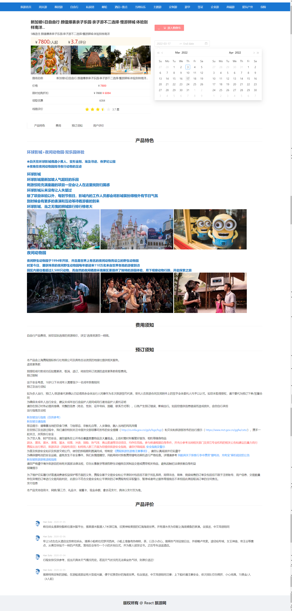
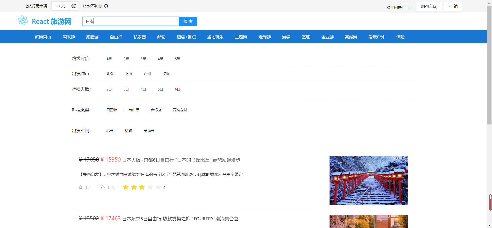
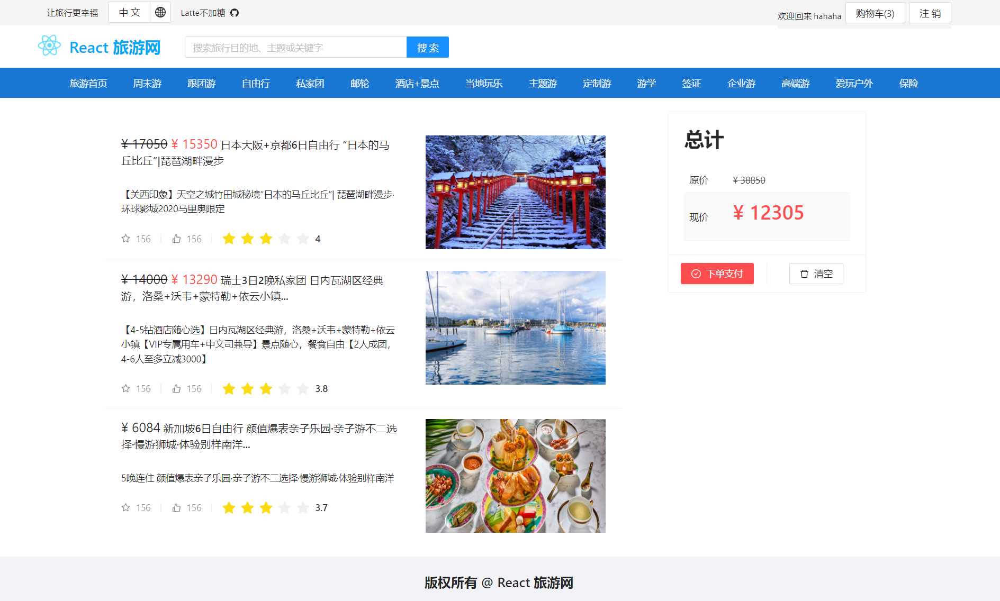
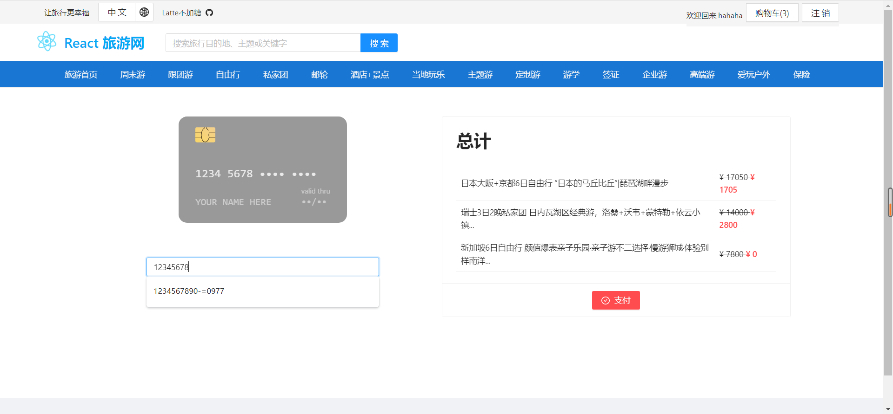

# react_travel

react+typescript 仿照携程网搭建电商平台 使用假数据实现若干功能

**首页：**

**登录注册页面：**

**详情页面：**包括旅游展示、产品特色、费用、预定需知和用户评价；可以将商品添加至购物车。

**搜索页面：**根据关键词检索。

**购物车页面：**查看加入购物车的商品，点击下单支付转至支付页面，此外可以清空购物车。

**支付页面：**扫码支付；银行卡支付，显示总计页面，点击支付按钮进行支付。

